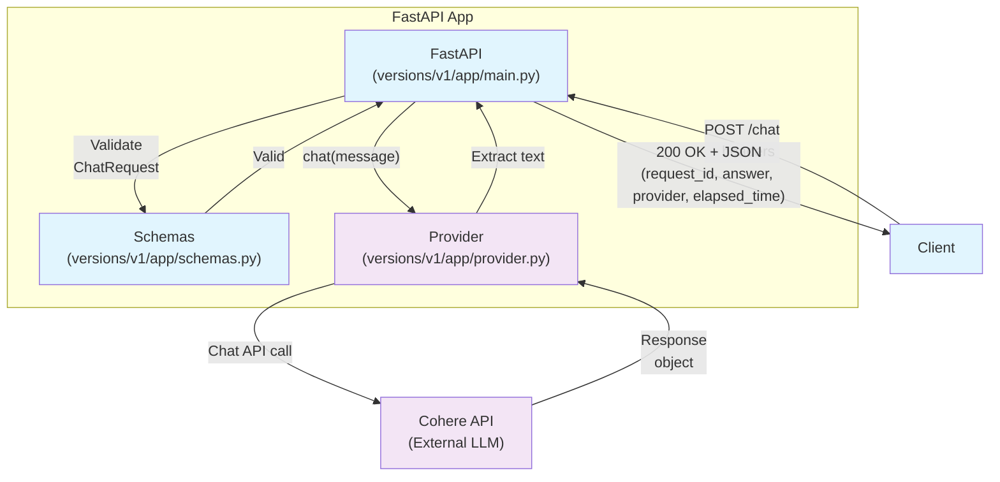
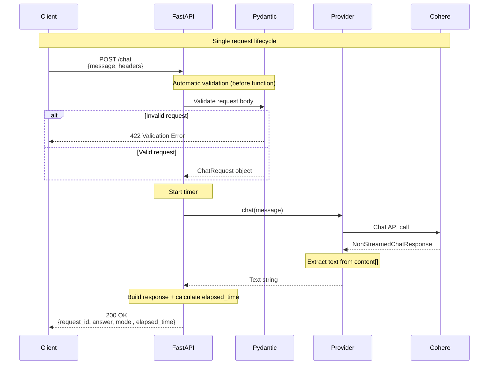

# Building a Simple Chat Gateway with FastAPI and Cohere

A minimal guide to building a chat API backend with FastAPI and Cohere. This is the simplest possible implementation - we'll add complexity later.

**What we're building:**
- HTTP POST endpoint that accepts chat messages
- Routes to Cohere's API
- Returns response with timing metrics

**Stack:**
- FastAPI + Cohere SDK + uv (package manager) + Pydantic

## Setup

```bash
mkdir chat-api && cd chat-api
uv init
uv add "fastapi[standard]" cohere python-dotenv
```

Requirements:
- Python 3.10+ (for `str | None` and `typing.Annotated`)
- cohere>=5.x (for `ClientV2` and `response.message.content`)

Create `.env`:
```bash
COHERE_API_KEY=your_api_key_here
COHERE_DEFAULT_MODEL=command-r-plus-08-2024
```

Tip:
- Don’t commit `.env` to version control.
- This guide uses `uv run` to ensure the environment is activated. If you prefer a venv: `uv venv && source .venv/bin/activate`, then use `python`/`fastapi` directly.

## Exploring the Cohere API

First, let's see what we're working with. Create `versions/v1/experiments/main.py`:

```python
import os
import cohere
from dotenv import load_dotenv

load_dotenv()

def main():
    co = cohere.ClientV2(api_key=os.getenv("COHERE_API_KEY"))
    response = co.chat(
        model=os.getenv("COHERE_DEFAULT_MODEL"),
        messages=[{"role": "user", "content": "Hello World?"}]
    )
    print(response)

if __name__ == "__main__":
    main()
```

Run it: `uv run python versions/v1/experiments/main.py`

Output:
```
NonStreamedChatResponse(
    id='...',
    message=Message_ChatMessage(
        role='assistant',
        content=[
            TextContent(type='text', text='Hello! How can I assist you today?')
        ],
        tool_plan='',
        tool_calls=None,
        citations=None
    ),
    finish_reason='COMPLETE',
    usage=Usage(billed_units=..., tokens=...),
    ...
)
```

Key observation: Response content is in `response.message.content[]` where each item has a `type` (usually `"text"`) and the actual text content. We'll need to extract this.

## Defining the API Contract

Create `versions/v1/app/schemas.py`:

```python
from pydantic import BaseModel
from pydantic import Field

class ChatRequest(BaseModel):
    message: str = Field(..., min_length=1, max_length=1000)

class ChatResponse(BaseModel):
    request_id: str
    answer: str
    model: str
    elapsed_time: int
```

## The Provider Abstraction

Create `versions/v1/app/provider.py`:

```python
import os
import cohere
from dotenv import load_dotenv
from abc import ABC, abstractmethod

load_dotenv()

class Provider(ABC):
    @abstractmethod
    def chat(self, message: str) -> str:
        pass

class CohereProvider(Provider):
    name = "cohere"

    def chat(self, message: str) -> str:
        co = cohere.ClientV2(api_key=os.getenv("COHERE_API_KEY"))
        response = co.chat(
            model=os.getenv("COHERE_DEFAULT_MODEL"),
            messages=[{"role": "user", "content": message}]
        )

        # Extract text from content items
        text_parts = []
        for item in response.message.content:
            if item.type == "text":
                text_parts.append(item.text)
        return ''.join(text_parts)
```

## The FastAPI Gateway

Create `versions/v1/app/main.py`:

```python
import time, uuid
from fastapi import FastAPI, HTTPException, Header
from app.schemas import ChatRequest, ChatResponse
from app.provider import CohereProvider
from typing import Annotated

app = FastAPI(title="Chat Gateway V1")
provider = CohereProvider()

@app.post("/chat", response_model=ChatResponse)
def chat(req: ChatRequest, x_idempotency_key: Annotated[str | None, Header()] = None):
    start = time.perf_counter()
    try:
        answer = provider.chat(req.message)
    except Exception as e:
        raise HTTPException(status_code=502, detail="Upstream failed") from e

    elapsed_ms = int((time.perf_counter() - start) * 1000)
    return ChatResponse(
        request_id=x_idempotency_key or str(uuid.uuid4()),
        answer=answer,
        model=provider.name,
        elapsed_time=elapsed_ms,
    )
```

Note: This is a synchronous endpoint. For production, you'd want to make the provider call non-blocking or run it in a threadpool.

## Running the Gateway

```bash
uv run fastapi run --app-dir versions/v1 app.main:app --reload
```

Server runs at `http://127.0.0.1:8000` with auto-reload and docs at `/docs`.

## Testing the API

```bash
curl -X POST http://127.0.0.1:8000/chat \
  -H "Content-Type: application/json" \
  -H "x-idempotency-key: test-123" \
  -d '{"message": "What is FastAPI?"}'
```

Response includes:
- `request_id`: Your idempotency key header (or auto-generated UUID)
- `answer`: Extracted text from Cohere
- `model`: Model name
- `elapsed_time`: Response time in milliseconds

## Architecture

Here's the complete technical flow showing backend design patterns:



**Component Mapping:**
- **FastAPI** → `versions/v1/app/main.py` (API layer, routing, timing, error handling)
- **Schemas** → `versions/v1/app/schemas.py` (Pydantic models for validation & serialization)
- **Provider** → `versions/v1/app/provider.py` (Abstraction for LLM providers)
- **Cohere** → External LLM API

**Key Backend Design Patterns:**

1. **Layered Architecture**
   - **API Layer** (`main.py`): HTTP handling, routing, cross-cutting concerns (timing, error mapping)
   - **Validation Layer** (`schemas.py`): Type safety, constraint enforcement, serialization
   - **Abstraction Layer** (`provider.py`): External service integration, provider-agnostic interface
   - **External Service**: Third-party LLM API

2. **Separation of Concerns**
   - Each layer has a single responsibility
   - Changes to Cohere API only affect `provider.py`
   - Adding new providers doesn't touch `main.py`
   - API contract changes isolated to `schemas.py`

3. **Error Boundaries**
   - Validation errors caught at Pydantic layer (422)
   - Provider errors caught at FastAPI layer, mapped to 502
   - Clean error responses hide implementation details

4. **Data Flow & Transformations**
   ```
   HTTP JSON → Pydantic Model → str → Cohere Format
                                            ↓
   HTTP JSON ← Pydantic Model ← str ← Cohere Response
   ```

5. **Observability**
   - Request IDs for tracing
   - Performance timing at gateway level
   - Structured responses for monitoring

## Request Flow

Here's the step-by-step sequence of a single chat request:



**Key Steps:**
1. **Client Request**: HTTP POST with message and optional idempotency key
2. **Automatic Validation**: Pydantic validates request body before function executes (422 on failure)
3. **Timer Start**: FastAPI starts performance timer (measures provider call only)
4. **Provider Call**: FastAPI invokes provider abstraction with message string
5. **Cohere API**: Provider calls Cohere SDK and receives response object
6. **Text Extraction**: Provider extracts text from response content array
7. **Response Building**: FastAPI assembles final JSON with metadata and elapsed time
8. **Client Response**: Return 200 OK with answer and metrics

## Summary

You now have a minimal chat gateway with:
- **3 files**: `schemas.py` (request/response models), `provider.py` (Cohere integration), `main.py` (FastAPI endpoint)
- **Provider pattern**: Easy to add other LLMs later
- **Type safety**: Pydantic validation throughout
- **Basic observability**: Request IDs and timing metrics

This is the foundation. Add streaming, conversation memory, multi-provider support, and production features (auth, rate limiting, logging) as needed.
