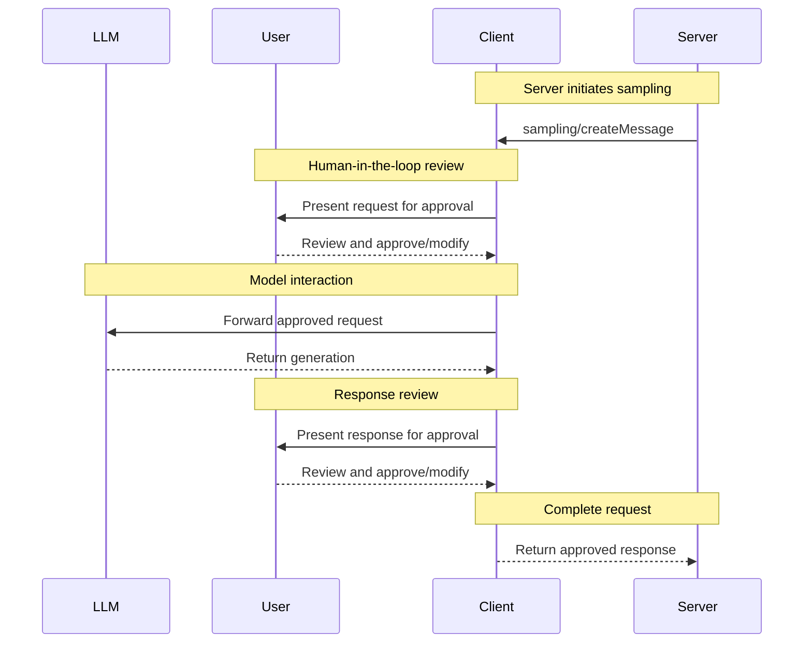
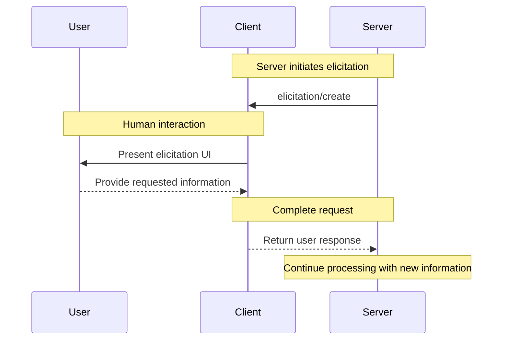

# Diagram Samples

This document contains examples of well-designed diagrams for reference.

## Sampling Flow

**Sampling flow:**

```mermaid
sequenceDiagram
    participant LLM
    participant User
    participant Client
    participant Server

    Note over Server,Client: Server initiates sampling
    Server->>Client: sampling/createMessage

    Note over Client,User: Human-in-the-loop review
    Client->>User: Present request for approval
    User-->>Client: Review and approve/modify

    Note over Client,LLM: Model interaction
    Client->>LLM: Forward approved request
    LLM-->>Client: Return generation

    Note over Client,User: Response review
    Client->>User: Present response for approval
    User-->>Client: Review and approve/modify

    Note over Server,Client: Complete request
    Client-->>Server: Return approved response
```

## Elicitation Flow

```mermaid
sequenceDiagram
    participant User
    participant Client
    participant Server

    Note over Server,Client: Server initiates elicitation
    Server->>Client: elicitation/create

    Note over Client,User: Human interaction
    Client->>User: Present elicitation UI
    User-->>Client: Provide requested information

    Note over Server,Client: Complete request
    Client-->>Server: Return user response

    Note over Server: Continue processing with new information
```